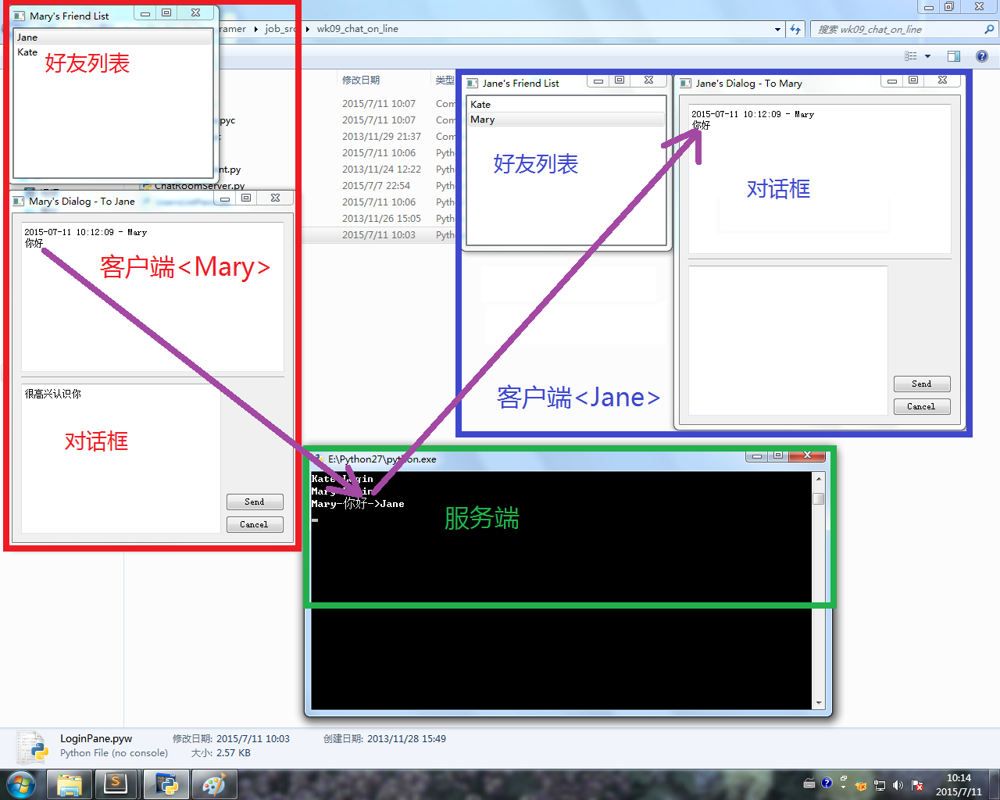

本程序需在windows下环境下运行，系统中需安装有pyqt，且已连上网络。

使用方法：

1. 打开 Hostip.py 文件，修改其中的 hostname 为本机的 ip ，并保存文件。（若使用默认的“127.0.0.1”，则本程序只能在本机运行）

2. 运行 ChatRoomServer.py 启动服务器。

3. 将所有文件拷贝至另外两台连网的电脑，分别运行 LoginPane.pyw ，分别输入用户名和密码，目前只有4个用户：Kate、Jane、Mary、More，密码都是123，注意两台电脑的输入的用户名不能相同。

4. 此时两台电脑都出现了一个好友列表，双击列表中的好友，将跳出聊天对话框，输入消息并按 send 键，即可将消息发给对方。

5. 上面的第3步中，也可以只在本机运行，在本机登录两个用户，也可以相互发送消息。

